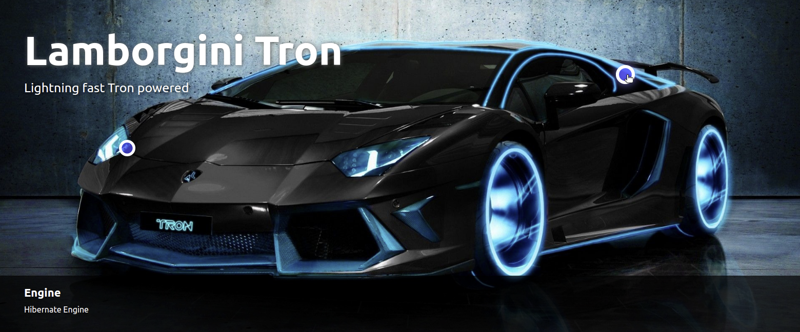
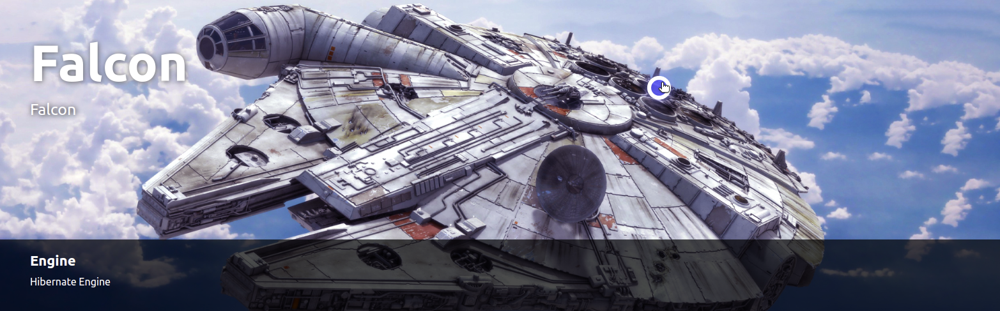

# Spaceship React

An example todo frontend development with react yet using the headless api to consume content.
You can create an interactive image with parts you can highlight

  
  
  

Developed to run on the following versions of Liferay and/or Commerce: `Liferay DXP 7.3`

Built with the [Liferay JS Generator](https://help.liferay.com/hc/articles/360029147391-Liferay-JS-Generator).

Based upon https://github.com/carloslancha/spaceship-react/

## How to Build and Deploy to Liferay

### Gradle
Run the task `packageRunBuild` and `packageRunDeploy`

### Npm
Follow the steps below to build and deploy or copy the modules from the [releases](../../releases/latest) page to your Liferay's deploy folder.

1. Update `.npmbuildrc` so that `liferayDir` points to your local Liferay bundle.
2. ` $ npm install // Get all dependencies.`

### Build it
3. ` $ npm run build // Builds project to /dist/${my-project}.jar`

### Deploy to Liferay
3. ` $ npm run deploy // Deploy to your Liferay instance.`

## Usage

[Adding Widgets to a Page.](https://learn.liferay.com/dxp/7.x/en/site-building/creating-pages/using-widget-pages/adding-widgets-to-a-page.html)

*Explain what's required to set up and make use of all of the modules features.*

### Features

* Feature One
    * 
* Feature Two
    * 
* Feature Three
    * 

*Wherever possible, include more images or gifs that explain the features of your project.*

## Issues & Questions Welcome